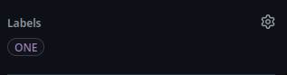
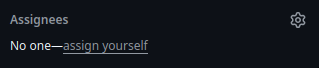

# \<div\> It Up.  
Begin your journey into web development.

## Getting Started

1. **To begin, fork this repository.**  
   Forking creates your own copy of the project where you can make changes.

2. **Clone your fork to your local machine.**  
   This allows you to work on the project offline and locally.

3. **Check the issues in this repository.**  
   Each issue represents a task to be completed.

<div align="left">
  
</div>

4. **Each issue is related to a specific task and should be solved separately.**  
   Focus on one issue at a time for clear and effective solutions.

5. **Create a new branch in your fork for each issue.**  
   This keeps your work organized and makes it easier to submit changes.

6. **Make the required changes and improvements.**  
   Implement your solution according to the task requirements.
   Things to keep in mind:
   - First check what your assignments are, There are assignment.md under every subtopic.
   - Also what are the documentation/solutions that you should add are mentioned in the README.md of respective Topics.

7. **Commit and push your changes to your fork.**  
   Once done, commit with a meaningful message and push to your fork.

8. **Create a pull request to this repository using the following format:**

```
**Title**
This PR is the solution to the 'js basics'  #<issue number>

**Description**
- What all did you learn?
- Any difficulties that you faced, and how you solved it?
- Did you have to learn anything new to do the assignments?
- Any thing else you would like to share about the topic?

```

9. **Add Label < ISSUE Number > to the PR as shown below**

<div align="left">
  
</div>

10. **Add < JATAYU000 > as the reviewer for your PR**

<div align="left">
  
</div>


9. **Only the best solution PR for each issue will be merged into this repository.**
